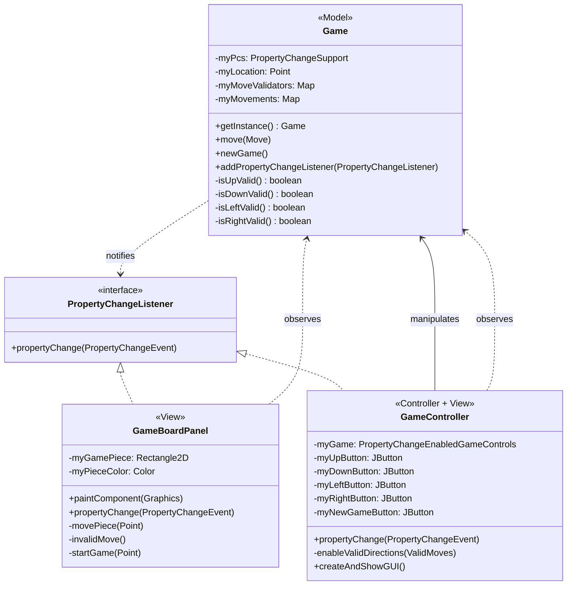

# Model-View-Controller (MVC) Pattern

## Brief History

The Model-View-Controller pattern was invented by Trygve Reenskaug in 1979 while visiting Xerox PARC. Working on the Smalltalk-76 programming environment, Reenskaug was tackling a fundamental problem: how to let users interact with complex information systems without the user interface code becoming hopelessly entangled with business logic.

His solution—MVC—was revolutionary for its time. The pattern formally separated an application into three distinct components: the Model (data and business rules), the View (presentation), and the Controller (user input handling). This was documented in his 1979 paper "Thing-Model-View-Editor" and refined throughout the early 1980s as Smalltalk evolved.

MVC became a cornerstone of object-oriented GUI development. It influenced virtually every major GUI framework that followed:

**Smalltalk-80**: The first widely-distributed implementation of MVC, where it became the standard architecture for building interactive applications.

**Java Swing** (JDK 1.2, 1998): Adopted a modified MVC approach called "separable model architecture." Swing components like `JTable` and `JTree` use distinct model objects (`TableModel`, `TreeModel`) separate from their visual representations.

**Modern Web Frameworks** (2000s-present): Frameworks like Ruby on Rails, Django, and Spring MVC adapted the pattern for web applications, though they often modify it significantly (sometimes called "Model 2" or "MVC-inspired").

While modern reactive frameworks have introduced alternatives (like MVVM, Flux, and unidirectional data flow), MVC remains influential and is still taught as a foundational pattern because it clearly demonstrates separation of concerns—a principle that transcends any single pattern.

## The Problem It Solves

Imagine you're running a restaurant. Customers look at a menu board on the wall to see what dishes are available and their prices. When they want to order, they tell the waiter what they'd like. The waiter takes that order to the kitchen, where the chef looks at what ingredients are available, prepares the food, and updates inventory. When the menu changes—maybe salmon runs out, or the daily special changes—someone updates the board so customers see the current offerings.

Now imagine if the menu board itself had to track inventory, take orders, cook food, and update itself when things changed. That's chaos. The board would need to know about cooking techniques, ingredient storage, and customer preferences. If you wanted to add a second menu board in a different location, you'd have to duplicate all that logic. If you wanted to let customers order via phone instead of in person, you'd have to rebuild everything.

The smart approach is separation: the kitchen (data and business logic) handles ingredients and cooking, the waiter (controller) takes customer input and communicates it to the kitchen, and the menu board (view) just displays whatever the current state is. When the kitchen runs out of salmon, it announces this fact, and any menu boards listening update themselves accordingly. The kitchen doesn't need to know how many menu boards exist or where they are. The menu boards don't need to understand cooking. The waiter translates customer requests into kitchen operations.

## How the Pattern Solves It

The Model-View-Controller pattern divides an interactive application into three interconnected components, each with a single, well-defined responsibility:

**Model**: The Model holds the application's data and business logic. It knows nothing about how data will be displayed or how users will interact with it. When the Model's state changes, it notifies interested observers—but it doesn't know or care what they'll do with that information. In our codebase, the `Game` class is the Model: it tracks the piece location, validates moves, and enforces game rules.

**View**: The View displays the Model's data to the user. It observes the Model and updates its presentation whenever the Model changes. The View doesn't modify data or contain business logic—it's purely presentational. In our codebase, `GameBoardPanel` is the View: it renders the game board and piece based on the current Model state.

**Controller**: The Controller handles user input. It interprets user actions (button clicks, key presses) and translates them into operations on the Model. The Controller can also update its own UI elements (like enabling/disabling buttons) in response to Model changes. In our codebase, `GameController` handles keyboard input and button clicks, calling methods on the Model and updating button states.

The key insight is that **data flows in one direction**: user actions go to the Controller, the Controller manipulates the Model, the Model notifies the View, and the View updates its display. The Model never directly calls the View or Controller. This separation means you can:
- Swap Views without touching business logic (desktop GUI to web interface)
- Add multiple Views of the same Model (controller panel and game board in our app)
- Test business logic without a GUI
- Have different Controllers for different input methods (mouse, keyboard, touch)

MVC relies heavily on the Observer pattern: the Model is an Observable subject, and Views/Controllers are observers that react to state changes.

### UML Class Diagram - Our MVC Implementation



**Key Relationships:**
- **GameController → Game** (solid arrow): Controller has a reference to the Model and calls its methods
- **Game ..> PropertyChangeListener** (dashed arrow): Model notifies observers (doesn't know their concrete types)
- **GameBoardPanel ..> Game** (dashed arrow): View observes Model changes
- **GameController ..> Game** (dashed arrow): Controller also observes Model to update its own UI

**Note:** In this implementation, `GameController` serves a dual role:
- **Controller**: Handles user input (button clicks, keyboard) and translates it into Model operations
- **View**: Updates its own UI components (button enable/disable states) by observing the Model

This hybrid Controller-View is common in real-world Swing applications where the controller manages its own visual components.

**Additional Complexity:** The `GameController` class is actually a *composition of multiple controllers*:
- **Button Click Controller**: ActionListeners attached to each button (lines 141-164) handle mouse/touch input
- **Keyboard Controller**: KeyAdapters (lines 257-294) handle keyboard input
- **Visual Controller**: PropertyChangeListener implementation (lines 241-252) updates button states

Each of these is a separate controller mechanism within the single `GameController` class. Different input methods (mouse, keyboard) are handled by different controller components, all coordinating calls to the same Model. This demonstrates that "Controller" in MVC is often not a monolithic entity, but rather a collection of input handlers working together.

## Technical Implementation in Our Codebase

This project demonstrates MVC architecture for a simple game where a piece moves on a grid. The separation of concerns is clean and illustrative of the pattern's benefits.

### The Model: Game Class

The `Game` class is our Model—it holds all game state and enforces business rules. See the full [Game.java](../../src/edu/uw/tcss/game/model/Game.java) implementation.

**State Management**

The Model maintains the single source of truth for game state (lines 50-51):

```java
public final class Game implements PropertyChangeEnabledGameControls {
    private final PropertyChangeSupport myPcs;
    private Point myLocation;

    private Game() {
        super();
        myLocation = STARTING_LOCATION;
        myPcs = new PropertyChangeSupport(this);
        // ...
    }
}
```

The `myLocation` field is the game's state. Everything else—the visual display, button states, etc.—derives from this state.

**Business Logic**

The Model contains all game rules and validation logic. Movement validation (lines 237-266):

```java
private boolean isUpValid() {
    return myLocation.y() > 0;
}

private boolean isDownValid() {
    return myLocation.y() < HEIGHT - 1;
}

private boolean isLeftValid() {
    return myLocation.x() > 0;
}

private boolean isRightValid() {
    return myLocation.x() < WIDTH - 1;
}
```

The `move()` method (lines 111-129) enforces these rules:

```java
@Override
public void move(final Move theMove) {
    Objects.requireNonNull(theMove, "theMove cannot be null");
    if (myMoveValidators.get(theMove).getAsBoolean()) {
        myLocation = myMovements.get(theMove).get();
        final GameEvent event =
                new GameEvent.MoveEvent(theMove,
                        myLocation,
                        calculateValidDirections(),
                        GameEvent.now());
        myPcs.firePropertyChange(event.getPropertyName(), null, event);
    } else {
        final GameEvent event =
                new GameEvent.InvalidMoveEvent(myLocation,
                        theMove,
                        GameEvent.now());
        myPcs.firePropertyChange(event.getPropertyName(), null, event);
    }
}
```

Notice: the Model doesn't know about `GameBoardPanel`, `GameController`, buttons, or painting. It just tracks state and enforces rules.

**Model Change Notifications**

The Model uses Java's `PropertyChangeSupport` to notify observers when state changes. This is the Observer pattern in action—see [Observer.md](./Observer.md) for detailed explanation. When state changes, the Model fires an event (line 121), and `PropertyChangeSupport` notifies all registered listeners.

The Model exposes observer registration through its interface (lines 196-216):

```java
@Override
public void addPropertyChangeListener(final PropertyChangeListener theListener) {
    myPcs.addPropertyChangeListener(theListener);
}

@Override
public void removePropertyChangeListener(final PropertyChangeListener theListener) {
    myPcs.removePropertyChangeListener(theListener);
}
```

This allows Views and Controllers to register themselves as observers without the Model knowing who they are.

### The View: GameBoardPanel Class

The `GameBoardPanel` is our View—it presents the Model's state visually. See [GameBoardPanel.java](../../src/edu/uw/tcss/game/gui/view/GameBoardPanel.java) (lines 23-173).

**Pure Presentation**

The View is responsible only for rendering. It maintains visual state like the piece rectangle and color (lines 40-43):

```java
private final Rectangle2D myGamePiece;
private Color myPieceColor;
```

The `paintComponent()` method (lines 112-127) draws the game board:

```java
@Override
public void paintComponent(final Graphics theGraphics) {
    super.paintComponent(theGraphics);
    final Graphics2D g2d = (Graphics2D) theGraphics;

    // for better graphics display
    g2d.setRenderingHint(RenderingHints.KEY_ANTIALIASING,
            RenderingHints.VALUE_ANTIALIAS_ON);

    // Draw pre-calculated grid lines
    g2d.setPaint(Color.BLACK);
    g2d.draw(GRID_PATH);

    // Draw pre-calculated game piece rectangle
    g2d.setPaint(myPieceColor);
    g2d.fill(myGamePiece);
}
```

Notice: no game logic here. The View doesn't validate moves or calculate positions—it just renders whatever it's told to render.

**Observing the Model**

The View implements `PropertyChangeListener` (line 23) to observe Model changes:

```java
public class GameBoardPanel extends JPanel implements PropertyChangeListener {
```

When the Model changes, the View's `propertyChange()` method is called (lines 160-172):

```java
@Override
public void propertyChange(final PropertyChangeEvent theEvent) {
    if (theEvent.getNewValue() instanceof final GameEvent event) {
        switch (event) {
            case final GameEvent.MoveEvent moveEvent ->
                    movePiece(moveEvent.newLocation());
            case final GameEvent.InvalidMoveEvent invalidEvent ->
                    invalidMove();
            case final GameEvent.NewGameEvent newGameEvent ->
                    startGame(newGameEvent.startingLocation());
        }
    }
}
```

The View reacts to Model changes by updating its visual representation. For valid moves, it updates the piece location (lines 134-138):

```java
private void movePiece(final GameControls.Point theLocation) {
    updatePieceRectangle(theLocation.x(), theLocation.y());
    myPieceColor = Color.BLACK;
    repaint();
}
```

The View never modifies the Model. It's a read-only observer that translates data into pixels.

### The Controller: GameController Class

The `GameController` handles user input and translates it into Model operations. See [GameController.java](../../src/edu/uw/tcss/game/gui/contoller/GameController.java) (line 32).

**Input Handling**

The Controller creates UI components for user interaction (lines 68-81):

```java
private final JButton myUpButton;
private final JButton myDownButton;
private final JButton myLeftButton;
private final JButton myRightButton;
private final JButton myNewGameButton;
```

It attaches listeners to translate button clicks into Model operations (lines 141-164):

```java
myUpButton.addActionListener(theEvent -> {
    myGame.moveUp();
    requestFocusInWindow();
});
myDownButton.addActionListener(theEvent -> {
    myGame.moveDown();
    requestFocusInWindow();
});
myRightButton.addActionListener(theEvent -> {
    myGame.moveRight();
    requestFocusInWindow();
});
myLeftButton.addActionListener(theEvent -> {
    myGame.moveLeft();
    requestFocusInWindow();
});
myNewGameButton.addActionListener(theEvent -> {
    myGame.newGame();
    requestFocusInWindow();
});
```

The Controller also handles keyboard input through key adapters (lines 257-294):

```java
private final class MyControlsKeyAdapter extends KeyAdapter {
    @Override
    public void keyPressed(final KeyEvent theEvent) {
        mapKeys(theEvent.getKeyCode()).run();
    }

    private Runnable mapKeys(final int theKeyCode) {
        final Runnable doNothing = () -> { };

        return switch (theKeyCode) {
            case KeyEvent.VK_W -> myGame::moveUp;
            case KeyEvent.VK_S -> myGame::moveDown;
            case KeyEvent.VK_A -> myGame::moveLeft;
            case KeyEvent.VK_D -> myGame::moveRight;
            default -> doNothing;
        };
    }
}
```

Notice: the Controller doesn't contain game logic. It doesn't know if a move is valid—it just asks the Model to perform the move. The Model decides if it's valid.

**Updating Controller State**

Controllers can also observe the Model to update their own UI components. The `GameController` implements `PropertyChangeListener` (line 31) and updates button states based on valid moves (lines 241-252):

```java
@Override
public void propertyChange(final PropertyChangeEvent theEvent) {
    if (theEvent.getNewValue() instanceof final GameEvent event) {
        switch (event) {
            case final GameEvent.MoveEvent moveEvent ->
                    enableValidDirections(moveEvent.validMoves());
            case final GameEvent.NewGameEvent newGameEvent ->
                    enableValidDirections(newGameEvent.validMoves());
            default -> { }
        }
    }
}
```

> **Modern Java Feature**: This code uses **pattern matching for switch** (Java 21) with sealed types for exhaustive event handling. The action listeners use **lambdas** (Java 8) for concise callback definitions. See the [Pattern Matching Guide](../../modern-java-features/PatternMatching.md) and [Functional Programming Guide](../../modern-java-features/FunctionalProgramming.md) for details.

The `enableValidDirections()` method (lines 231-238) enables/disables buttons:

```java
private void enableValidDirections(final GameControls.ValidMoves theValidMoves) {
    final Map<GameControls.Move, Boolean> moves =
            theValidMoves.moves();
    myUpButton.setEnabled(moves.get(GameControls.Move.UP));
    myDownButton.setEnabled(moves.get(GameControls.Move.DOWN));
    myLeftButton.setEnabled(moves.get(GameControls.Move.LEFT));
    myRightButton.setEnabled(moves.get(GameControls.Move.RIGHT));
}
```

This is a key MVC insight: **the Controller updates its own view** (the buttons), but doesn't touch the game View (`GameBoardPanel`). Each component observes the Model independently.

### Wiring It Together

The three components are connected in the `createAndShowGUI()` method (lines 178-205):

```java
public static void createAndShowGUI() {
    //Create and set up the window.
    final JFrame frame = new JFrame("Play the Game");
    frame.setDefaultCloseOperation(JFrame.EXIT_ON_CLOSE);

    final Game game = Game.getInstance();

    //Create and set up the content pane.
    final GameController pane = new GameController(game);

    //Add the GameController object itself as a PCL to the model.
    game.addPropertyChangeListener(pane);
    frame.setContentPane(pane);

    //Create a Game Panel to listen to and demonstrate our Game.
    final GameBoardPanel gamePanel = new GameBoardPanel();
    game.addPropertyChangeListener(gamePanel);
    SwingUtilities.invokeLater(() -> createAndShowView(frame, gamePanel));

    //Display the window.
    frame.setVisible(true);
}
```

Notice the wiring:
1. Create the Model (`Game.getInstance()`)
2. Create the Controller, passing it a reference to the Model
3. Register the Controller as an observer of the Model
4. Create the View
5. Register the View as an observer of the Model

Now when a user interaction occurs:

1. **User presses 'W' key** → KeyAdapter in Controller catches the event
2. **Controller calls `myGame.moveUp()`** → Translates input into Model operation
3. **Model validates the move** → Business logic determines if move is legal
4. **Model updates state** (`myLocation` changes) → Single source of truth modified
5. **Model fires PropertyChangeEvent** → Observer pattern notification
6. **Controller receives event** → Updates button enabled/disabled states
7. **View receives event** → Repaints the piece at the new location

The Model, View, and Controller remain decoupled. Each can be modified, tested, or replaced independently.

## Benefits & Tradeoffs

**Benefits:**

- **Separation of concerns**: Business logic (Model) is isolated from presentation (View) and input handling (Controller). Each component has a single, clear responsibility.
- **Multiple views of the same data**: You can have many Views observing one Model. In our app, we have two: `GameBoardPanel` (visual game board) and `GameController` (button states). Adding a score display or move history panel would be trivial—just create another observer.
- **Parallel development**: Different team members can work on Model, View, and Controller simultaneously without conflicts. The backend developer works on game logic while the UI designer works on visual presentation.
- **Easier testing**: Business logic can be tested without any GUI. You can write unit tests that call `game.move()` and verify state changes without ever creating a `JPanel` or `JButton`.
- **Flexibility**: Swapping input methods (keyboard to touchscreen) means changing the Controller. Changing visual style (2D to 3D rendering) means changing the View. Business rules remain untouched.

**Tradeoffs:**

- **Increased complexity for simple UIs**: If your application is a single input field and a submit button, MVC is overkill. The overhead of creating three separate components isn't worth it for trivial applications.
- **More classes and indirection**: Following the pattern strictly means more files, more interfaces, and more layers. Tracing execution from button click to visual update involves jumping between multiple classes.
- **Controller can become bloated**: In complex UIs, the Controller often becomes a dumping ground for anything that doesn't clearly fit in Model or View—initialization code, dialog management, navigation logic. This is sometimes called the "Massive View Controller" problem.
- **Potential for over-separation**: Students sometimes take separation too far, creating excessive abstractions or making simple operations unnecessarily complex by routing everything through the MVC structure.

## Common Pitfalls

**Putting business logic in the Controller or View**: The most common mistake is scattering game rules across components. If you're validating moves in the Controller, or calculating valid positions in the View, you've broken MVC. All business logic belongs in the Model. The Controller should be dumb about business rules—it just translates input. The View should be dumb about data—it just renders.

**The View querying the Model directly**: Some students make Views that hold a reference to the Model and call its getter methods during painting. While this works, it's fragile. If the Model changes state between when the event fires and when `paintComponent()` runs, you get inconsistent state. Better: the event should include all data needed by observers (our sealed event records do this—`MoveEvent` includes `newLocation` and `validMoves`).

**Controller modifying View components directly**: In complex UIs, it's tempting to have the Controller reach into the View and modify its components (`gamePanel.setGamePieceColor(Color.RED)`). This creates tight coupling. Better: the Controller modifies the Model, the Model fires an event, and the View updates itself.

**Circular dependencies**: If your Model imports View classes, you've created circular dependency. The Model should have no knowledge of View or Controller. Use Observer pattern (interfaces and events) to maintain unidirectional dependency.

**Forgetting to unregister observers**: When Views or Controllers are destroyed (window closed, panel removed), they must unregister themselves from the Model via `removePropertyChangeListener()`. Otherwise, the Model maintains references preventing garbage collection. This causes memory leaks in long-running applications.

**Over-complicating simple problems**: Not every class needs to be MVC. If you're building a simple settings dialog, you don't need a separate Model class for "Settings"—sometimes a few fields in a Controller suffice. Apply the pattern when separation provides value, not dogmatically.

## Related Patterns

**Observer**: The backbone of MVC. The Model is the subject, Views and Controllers are observers. MVC cannot function without Observer. When the Model changes state, it uses the Observer pattern to notify all interested components. See [Observer.md](./Observer.md) for detailed explanation of how this works in our codebase.

**Strategy**: Our codebase combines MVC with Strategy. The `Game` class uses Strategy pattern for move validation and movement calculations (lines 67-76 in Game.java)—different strategies for different directions. This shows how patterns compose: MVC for architecture, Observer for communication, Strategy for algorithms. See [Strategy.md](./Strategy.md).

**Singleton**: The `Game` Model uses the Singleton pattern to ensure only one game instance exists (lines 44-94 in Game.java). This is common for Model objects representing application state—you want a single source of truth, not multiple competing game instances.

**Command**: In more complex applications, Controllers often use the Command pattern to represent user actions as objects. This enables undo/redo, action queuing, and macro recording. Our simple app uses direct method calls (`myGame.moveUp()`), but scaling up would benefit from commands.

**Mediator**: Sometimes confused with MVC. Both decouple components, but Mediator centralizes component communication through a mediator object (many-to-many relationships), while MVC uses Observer for Model-to-View communication (one-to-many) and direct calls for Controller-to-Model (one-to-one).

## Further Reading

- **Design Patterns: Elements of Reusable Object-Oriented Software** by Gamma, Helm, Johnson, Vlissides (1994) - MVC is discussed in the introduction (pages 4-6) as a "design pattern catalog" and its relationship to Observer, Composite, and Strategy patterns
- **"A cookbook for using the model-view controller user interface paradigm in Smalltalk-80"** by Glenn E. Krasner and Stephen T. Pope, *Journal of Object-Oriented Programming* (August/September 1988) - The definitive early paper explaining MVC from the Smalltalk-80 perspective
- **"Thing-Model-View-Editor: an Example from a planning system"** by Trygve Reenskaug (1979) - The original technical note from Xerox PARC introducing MVC (available online)
- **"MVC is dead, it's time to MOVE on"** by Andre Staltz (2015) - A provocative blog post arguing for unidirectional data flow patterns in modern web development; useful for understanding when MVC's limitations appear
- **Head First Design Patterns** by Freeman & Freeman (2004) - Chapter 12 combines multiple patterns including MVC in a practical DJ application example
- **"The DCI Architecture: A New Vision of Object-Oriented Programming"** by Trygve Reenskaug and James Coplien (2009) - Reenskaug's evolution of thinking beyond MVC for the modern era
- [The Java Tutorials: Swing Architecture](https://docs.oracle.com/javase/tutorial/uiswing/overview/architecture.html) - Oracle's explanation of the "separable model architecture" used in Swing components
