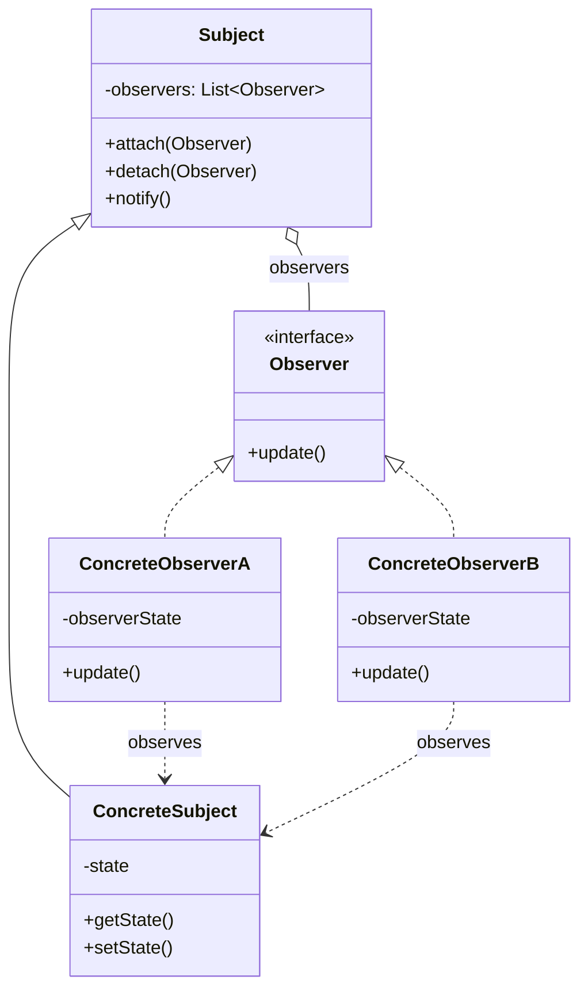
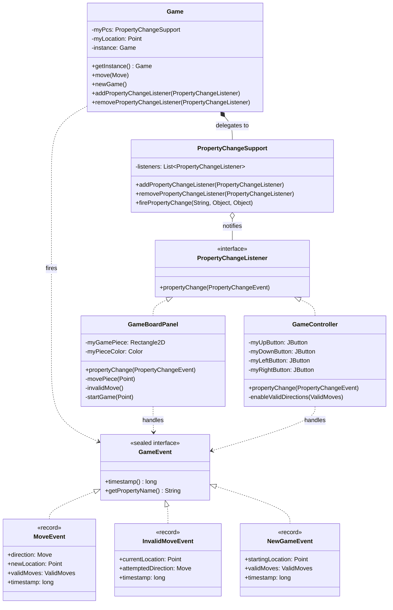

# Observer Pattern

## Brief History

The Observer pattern was first catalogued by the "Gang of Four" (Erich Gamma, Richard Helm, Ralph Johnson, and John Vlissides) in their seminal 1994 book *Design Patterns: Elements of Reusable Object-Oriented Software*. However, the concept of observers watching for state changes predates this formalization—it's rooted in event-driven programming models from the 1980s and earlier GUI frameworks.

The pattern is also known as **Publish-Subscribe** or the **Dependents** pattern. Java has provided several implementations of this pattern over the years:

**`java.util.Observable` and `java.util.Observer`** (JDK 1.0 - Deprecated in Java 9): Java's first built-in observer framework required subjects to extend the `Observable` class. This was problematic because it forced inheritance (preventing you from extending other classes), wasn't thread-safe, and provided limited control over what data was sent to observers. The API was deprecated in Java 9 due to these design flaws.

**`java.beans.PropertyChangeListener`** (JDK 1.1 - Still widely used): This framework was designed specifically for JavaBeans and Swing GUI components. Instead of requiring inheritance, it uses a delegation model with `PropertyChangeSupport` to manage observers. This is the approach our codebase uses because it's flexible, thread-safe, and purpose-built for notifying about property changes in components.

**`java.util.concurrent.Flow`** (Java 9+): The newest observer implementation follows the Reactive Streams specification, providing backpressure support for asynchronous data streams. While powerful for complex reactive applications, it's significantly more complicated than `PropertyChangeListener` and isn't tailored for Swing GUI applications. For our use case—simple property change notifications in a Swing application—`PropertyChangeListener` is the better choice.

## The Problem It Solves

Imagine you're building a weather station that collects temperature data. Multiple devices need to react to temperature changes: a display screen should update the current temperature, an alert system should warn if it gets too hot or cold, and a logging system should record the data.

The naive approach would have the weather station directly call methods on each device whenever the temperature changes. But this creates tight coupling—the weather station needs to know about every device that cares about temperature. If you want to add a new device, you have to modify the weather station code. If a device is removed, you risk errors. The weather station becomes a tangled mess of dependencies.

You need a way for the weather station to announce "the temperature changed" without knowing or caring who's listening. Devices should be able to subscribe to updates when they're interested, and unsubscribe when they're not—all without the weather station having to track them explicitly.

## How the Pattern Solves It

The Observer pattern introduces two key roles:

**Subject (Observable)**: The object that holds state and notifies others when it changes. The subject maintains a list of interested observers and provides methods to register/unregister them. When state changes, the subject loops through its observers and notifies each one.

**Observer**: Objects that want to be notified of changes. Each observer implements a standard interface with an update/notification method. When the subject calls this method, the observer receives information about what changed and can react accordingly.

This decouples the subject from the observers. The subject only knows "I have a list of objects that implement the Observer interface." Observers can come and go dynamically. The subject announces changes without knowing what observers will do with that information—and that's exactly how it should be.

The key insight: **push notifications instead of continuous polling**. Rather than each device constantly checking "has the temperature changed yet?", the weather station pushes updates only when changes occur.

### UML Class Diagram - Generic Observer Pattern



In this classic structure, the `Subject` maintains a collection of `Observer` instances. When state changes in a `ConcreteSubject`, it calls `notify()`, which loops through all registered observers and calls their `update()` method. Each `ConcreteObserver` can then query the subject for its new state or receive the state as a parameter.

## Technical Implementation in Our Codebase

This project demonstrates a modern take on the Observer pattern using Java's `PropertyChangeListener` framework enhanced with type-safe sealed events (a Java 21 feature).

### UML Class Diagram - Our Implementation



This diagram shows how our implementation uses delegation (`Game` delegates observer management to `PropertyChangeSupport`) and sealed event types (`GameEvent` with three record implementations) to create a type-safe, modern Observer pattern.

### The Subject: Game Class

The `Game` class is our subject—it holds the game state (piece location) and notifies observers when that state changes. See the full [Game.java](../../src/edu/uw/tcss/game/model/Game.java) implementation.

**Using PropertyChangeSupport**

Instead of implementing our own observer registration and notification system (maintaining a list of observers, iterating through them, etc.), we delegate this responsibility to Java's built-in `PropertyChangeSupport` class. This helper class is part of the JavaBeans framework and does all the heavy lifting for us:
- Maintains the list of registered observers
- Provides thread-safe add/remove methods
- Handles the notification loop when we fire events
- Allows filtering by property name (though we don't use this feature)

Here's how we set it up in the `Game` constructor (lines 63-66):

```java
public final class Game implements PropertyChangeEnabledGameControls {
    private final PropertyChangeSupport myPcs;
    private Point myLocation;

    private Game() {
        myPcs = new PropertyChangeSupport(this);
        myLocation = STARTING_LOCATION;
        // ...
    }
}
```

The `PropertyChangeSupport(this)` constructor takes a reference to the subject object (the `Game` instance). This reference is included in property change events so observers can identify which object changed.

**Notifying Observers**

When the game state changes, we create a typed event and ask `PropertyChangeSupport` to notify all registered observers. Here's the `move()` method (lines 111-129):

```java
@Override
public void move(final Move theMove) {
    if (myMoveValidators.get(theMove).getAsBoolean()) {
        myLocation = myMovements.get(theMove).get();
        final GameEvent event = new GameEvent.MoveEvent(
            theMove,
            myLocation,
            calculateValidDirections(),
            GameEvent.now()
        );
        myPcs.firePropertyChange(event.getPropertyName(), null, event);
    }
}
```

The call to `myPcs.firePropertyChange()` triggers the notification process. `PropertyChangeSupport` loops through all registered observers and calls their `propertyChange()` method with information about what changed. We don't need to write this loop ourselves—`PropertyChangeSupport` handles it.

**Exposing the Observer Registration Interface**

The `Game` class implements the `PropertyChangeEnabledGameControls` interface (lines 196-216), which requires methods for adding and removing observers. We simply delegate these calls to our `PropertyChangeSupport` instance:

```java
@Override
public void addPropertyChangeListener(final PropertyChangeListener theListener) {
    myPcs.addPropertyChangeListener(theListener);
}

@Override
public void removePropertyChangeListener(final PropertyChangeListener theListener) {
    myPcs.removePropertyChangeListener(theListener);
}
```

This is the delegation pattern in action: `Game` implements the interface, but `PropertyChangeSupport` does the actual work.

### The Observer Interface

Observers implement Java's standard `PropertyChangeListener` interface, which requires one method:

```java
void propertyChange(PropertyChangeEvent evt);
```

Our project has two observers: `GameController` and `GameBoardPanel`, both implementing this interface.

### Observer 1: GameBoardPanel (The View)

The `GameBoardPanel` listens for game state changes and updates the visual display. See [GameBoardPanel.java](../../src/edu/uw/tcss/game/gui/view/GameBoardPanel.java) (line 23 for class declaration).

```java
public class GameBoardPanel extends JPanel implements PropertyChangeListener {

    @Override
    public void propertyChange(final PropertyChangeEvent theEvent) {
        if (theEvent.getNewValue() instanceof final GameEvent event) {
            switch (event) {
                case final GameEvent.MoveEvent moveEvent ->
                    movePiece(moveEvent.newLocation());
                case final GameEvent.InvalidMoveEvent invalidEvent ->
                    invalidMove();
                case final GameEvent.NewGameEvent newGameEvent ->
                    startGame(newGameEvent.startingLocation());
            }
        }
    }
}
```

See [GameBoardPanel.java](../../src/edu/uw/tcss/game/gui/view/GameBoardPanel.java) (lines 160-172 for the propertyChange implementation).

> **Modern Java Feature**: This code uses **pattern matching for switch** (Java 21) combined with sealed types to enable exhaustive, type-safe event handling. See the [Pattern Matching Guide](../../modern-java-features/PatternMatching.md) for details.

### Observer 2: GameController

The `GameController` listens for the same events but responds differently—it enables/disables directional buttons based on valid moves. See [GameController.java](../../src/edu/uw/tcss/game/gui/contoller/GameController.java) (line 32 for class declaration).

```java
@Override
public void propertyChange(final PropertyChangeEvent theEvent) {
    if (theEvent.getNewValue() instanceof final GameEvent event) {
        switch (event) {
            case final GameEvent.MoveEvent moveEvent ->
                enableValidDirections(moveEvent.validMoves());
            case final GameEvent.NewGameEvent newGameEvent ->
                enableValidDirections(newGameEvent.validMoves());
            default -> { }
        }
    }
}
```

See [GameController.java](../../src/edu/uw/tcss/game/gui/contoller/GameController.java) (lines 241-252 for the propertyChange implementation).

### Wiring It Together

Observers register themselves with the subject during setup. See [GameController.java](../../src/edu/uw/tcss/game/gui/contoller/GameController.java) (lines 179-205):

```java
public static void createAndShowGUI() {
    final Game game = Game.getInstance();
    final GameController pane = new GameController(game);

    // Register the controller as an observer
    game.addPropertyChangeListener(pane);

    // Register the view as an observer
    final GameBoardPanel gamePanel = new GameBoardPanel();
    game.addPropertyChangeListener(gamePanel);
}
```

Now when the game state changes (via `move()`, `newGame()`, etc.), both observers are automatically notified. The `Game` class doesn't know what the observers will do with the notification—it just announces the change.

### Type-Safe Events with Sealed Classes

This codebase modernizes the classic Observer pattern with Java 21's sealed classes. Instead of string-based property names (`"position"`, `"gameOver"`), we use sealed event types. See [GameEvent.java](../../src/edu/uw/tcss/game/model/GameEvent.java) (lines 1-129).

> **Modern Java Feature**: This implementation uses **sealed classes** (Java 17) combined with **records** (Java 16) to create type-safe event hierarchies. For a detailed explanation of these language features, see the [Sealed Classes Guide](../../modern-java-features/SealedClasses.md) and [Records Guide](../../modern-java-features/Records.md).

```java
public sealed interface GameEvent permits
        GameEvent.MoveEvent,
        GameEvent.InvalidMoveEvent,
        GameEvent.NewGameEvent {

    record MoveEvent(
        Move direction,
        Point newLocation,
        ValidMoves validMoves,
        long timestamp
    ) implements GameEvent { }

    record InvalidMoveEvent(
        Point currentLocation,
        Move attemptedDirection,
        long timestamp
    ) implements GameEvent { }

    record NewGameEvent(
        Point startingLocation,
        ValidMoves validMoves,
        long timestamp
    ) implements GameEvent { }
}
```

This gives us:
- **Compile-time type safety**: The compiler knows all possible event types
- **Exhaustiveness checking**: Switch statements must handle all cases
- **IDE support**: Autocomplete shows available events and their data
- **Self-documenting**: Event types clearly show what data they carry

## Benefits & Tradeoffs

**Benefits:**
- **Loose coupling**: Subject and observers are independent; you can add/remove observers without modifying the subject
- **Dynamic relationships**: Observers can register/unregister at runtime
- **Broadcast communication**: One subject can notify multiple observers simultaneously
- **Separation of concerns**: Business logic (subject) is separated from presentation/reaction logic (observers)

**Tradeoffs:**
- **Unexpected updates**: Observers may trigger cascading updates, causing performance issues
- **Memory leaks**: Forgetting to unregister observers can prevent garbage collection
- **Order dependency**: If observers rely on a specific notification order, you have hidden coupling
- **Debugging complexity**: The flow of execution jumps between subject and observers, making stack traces harder to follow

## Common Pitfalls

**Forgetting to unregister observers**: When an observer is no longer needed, you must explicitly remove it via `removePropertyChangeListener()`. Otherwise, the subject maintains a reference, preventing garbage collection. This is especially important with GUI components that get created and destroyed frequently.

**Modifying state in observer notifications**: If an observer modifies the subject's state during a notification, you can create infinite loops or unpredictable update cascades. Observers should react to state changes, not cause new ones.

**Assuming notification order**: Java's `PropertyChangeSupport` notifies observers in registration order, but relying on this creates hidden coupling. Each observer should be independent.

**Sending too much or too little data**: Our sealed event records include all relevant data (`newLocation`, `validMoves`) so observers don't need to query the subject. This avoids race conditions and simplifies observer logic. The classic mistake is sending just a "something changed" notification, forcing observers to ask "what changed?"—which can get the wrong answer if state changed again.

## Related Patterns

**Model-View-Controller (MVC)**: Observer is the backbone of MVC. The Model is the subject, Views are observers. This project uses MVC with `Game` as the Model, `GameBoardPanel` as the View, and `GameController` as the Controller. See [MVC.md](./MVC.md).

**Mediator**: Both patterns decouple objects, but Mediator centralizes communication through a mediator object, while Observer uses a distributed publish-subscribe approach. Use Observer when subjects and observers have a one-to-many relationship; use Mediator when you have many-to-many communication needs.

**Strategy**: Our codebase combines Observer with Strategy—the `Game` class uses strategy for move validation while using observer for state notifications. See [Strategy.md](./Strategy.md).

## Further Reading

- **Design Patterns: Elements of Reusable Object-Oriented Software** by Gamma, Helm, Johnson, Vlissides (1994) - Chapter 5, pages 293-303
- **Head First Design Patterns** by Freeman & Freeman (2004) - Chapter 2 provides an accessible introduction with a weather station example
- **Effective Java** by Joshua Bloch (3rd Edition, 2018) - Item 85: "Prefer alternatives to Java serialization" discusses `PropertyChangeListener` best practices
- [JavaBeans PropertyChangeListener Tutorial](https://docs.oracle.com/javase/tutorial/javabeans/writing/properties.html) - Official Oracle documentation
- [JEP 409: Sealed Classes](https://openjdk.org/jeps/409) - The Java feature that enables our type-safe events
- **A Pattern Language** by Christopher Alexander (1977) - The architectural work that inspired software design patterns